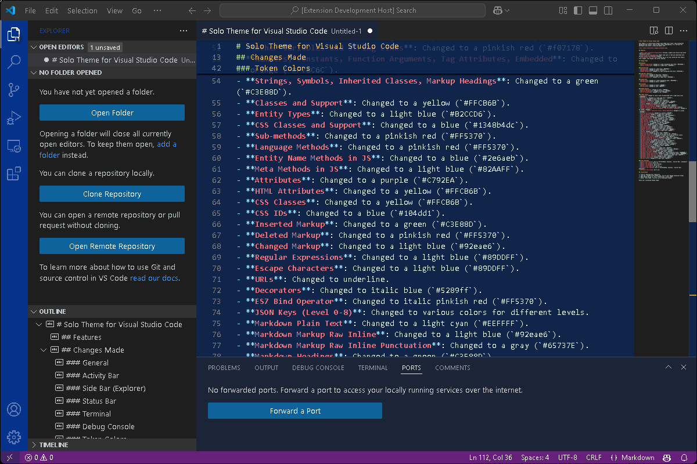

# Solo Theme for Visual Studio Code

Solo Theme is a custom Visual Studio Code theme with a dark, semi-transparent background and vibrant, easy-to-read syntax highlighting. It is perfect for developers who prefer a sleek and modern look.

## Features

- **Dark, Semi-Transparent Background**: Provides a modern and stylish look while reducing eye strain.
- **Vibrant Syntax Highlighting**: Makes code easy to read and understand with distinct colors for different elements.
- **Customizable Font Settings**: Allows you to set your preferred font family, size, weight, line height, and letter spacing.

## Changes Made

### General
- **Editor Background**: Changed to a semi-transparent dark blue (`#0f254e6b`).
- **Editor Foreground**: Changed to a light blue (`#1d53bedc`).

### Activity Bar
- **Background**: Changed to a dark blue (`#00349bdc`).
- **Foreground**: Changed to white (`#ffffff`).
- **Badge Background**: Changed to a semi-transparent dark blue (`#0f254e6b`).

### Side Bar (Explorer)
- **Background**: Changed to dark gray (`#1e1e1e`).
- **Foreground**: Changed to light gray (`#c5cccf`).
- **Title Foreground**: Changed to a light blue (`#164db9dc`).

### Status Bar
- **Background**: Changed to a semi-transparent gray (`#6b73836b`).
- **Foreground**: Changed to white (`#ffffff`).

### Terminal
- **Background**: Changed to black (`#000000`).
- **Foreground**: Changed to cyan (`#00FFFF`).

### Debug Console
- **Info Foreground**: Changed to green (`#00FF00`).
- **Warning Foreground**: Changed to yellow (`#FFFF00`).
- **Error Foreground**: Changed to red (`#FF0000`).

### Token Colors
- **Comments**: Changed to italic bold strikethrough with a light gray color (`#a0a0a0d3`).
- **Variables**: Changed to a light cyan color (`#EEFFFF`).
- **Colors**: Changed to white (`#ffffff`).
- **Invalid**: Changed to a pinkish red (`#FF5370`).
- **Keywords and Storage**: Changed to a light green (`#6fddb8`).
- **Operators and Misc**: Changed to a light blue (`#89DDFF`).
- **Tags**: Changed to a pinkish red (`#f07178`).
- **Functions and Special Methods**: Changed to a blue (`#2154c2`).
- **Block Level Variables**: Changed to a pinkish red (`#f07178`).
- **Other Variables and String Links**: Changed to a pinkish red (`#f07178`).
- **Numbers, Constants, Function Arguments, Tag Attributes, Embedded**: Changed to an orange (`#F78C6C`).
- **Strings, Symbols, Inherited Classes, Markup Headings**: Changed to a green (`#C3E88D`).
- **Classes and Support**: Changed to a yellow (`#FFCB6B`).
- **Entity Types**: Changed to a light blue (`#B2CCD6`).
- **CSS Classes and Support**: Changed to a blue (`#1348b4dc`).
- **Sub-methods**: Changed to a pinkish red (`#FF5370`).
- **Language Methods**: Changed to a pinkish red (`#FF5370`).
- **Entity Name Methods in JS**: Changed to a blue (`#2e6aeb`).
- **Meta Methods in JS**: Changed to a light blue (`#82AAFF`).
- **Attributes**: Changed to a purple (`#C792EA`).
- **HTML Attributes**: Changed to a yellow (`#FFCB6B`).
- **CSS Classes**: Changed to a yellow (`#FFCB6B`).
- **CSS IDs**: Changed to a blue (`#104dd1`).
- **Inserted Markup**: Changed to a green (`#C3E88D`).
- **Deleted Markup**: Changed to a pinkish red (`#FF5370`).
- **Changed Markup**: Changed to a light blue (`#92eae6`).
- **Regular Expressions**: Changed to a light blue (`#89DDFF`).
- **Escape Characters**: Changed to a light blue (`#89DDFF`).
- **URLs**: Changed to underline.
- **Decorators**: Changed to italic blue (`#5289ff`).
- **ES7 Bind Operator**: Changed to italic pinkish red (`#FF5370`).
- **JSON Keys (Level 0-8)**: Changed to various colors for different levels.
- **Markdown Plain Text**: Changed to a light cyan (`#EEFFFF`).
- **Markdown Markup Raw Inline**: Changed to a light blue (`#92eae6`).
- **Markdown Markup Raw Inline Punctuation**: Changed to a gray (`#65737E`).
- **Markdown Headings**: Changed to a green (`#C3E88D`).
- **Markup Italic**: Changed to italic pinkish red (`#f07178`).
- **Markup Bold**: Changed to bold pinkish red (`#f07178`).
- **Markup Bold-Italic**: Changed to bold pinkish red (`#f07178`).
- **Markup Underline**: Changed to underline orange (`#F78C6C`).
- **Markdown Blockquote**: Changed to gray (`#65737E`).
- **Markup Quote**: Changed to italic.
- **Markdown Links**: Changed to a light blue (`#82AAFF`).
- **Markdown Link Descriptions**: Changed to a light blue (`#92eade`).
- **Markdown Link Anchors**: Changed to a yellow (`#FFCB6B`).
- **Markup Raw Block**: Changed to a light blue (`#92eabe`).
- **Markdown Raw Block Fenced**: Changed to a semi-transparent black (`#00000050`).
- **Markdown Fenced Code Block**: Changed to a semi-transparent black (`#00000050`).
- **Markdown Fenced Code Block Variable**: Changed to a light cyan (`#EEFFFF`).
- **Markdown Fenced Language**: Changed to gray (`#65737E`).
- **Markdown Separator**: Changed to bold gray (`#65737E`).
- **Markup Table**: Changed to a light cyan (`#EEFFFF`).

### Font Settings
- **Editor Font Family**: Set to "YourFontName, Consolas, 'Courier New', monospace".
- **Editor Font Size**: Set to 15.
- **Editor Font Weight**: Set to normal.
- **Editor Line Height**: Set to 23.
- **Editor Letter Spacing**: Set to 0.5.
- **Terminal Font Family**: Set to "YourFontName, Consolas, 'Courier New', monospace".
- **Terminal Font Size**: Set to 15.

## Installation

### From GitHub

1. Clone or download this repository.
2. Open a terminal and navigate to the directory where you cloned the repository.
3. Run `vsce package` to create a `.vsix` file.
4. Open Visual Studio Code.
5. Go to the Extensions view by clicking the Extensions icon in the Activity Bar on the side of the window or by pressing `Ctrl+Shift+X`.
6. Click on the three dots in the top right corner of the Extensions view.
7. Select "Install from VSIX..." from the dropdown menu.
8. Navigate to the `.vsix` file you created and select it.

### From VSCode Marketplace

1. Open VSCode and go to `Extensions` (Ctrl+Shift+X).
2. Search for `Solo Theme`.
3. Click `Install`.
4. Go to `File > Preferences > Color Theme` and select `Solo Theme` from the list of available themes.

Enjoy your customized VSCode theme!
